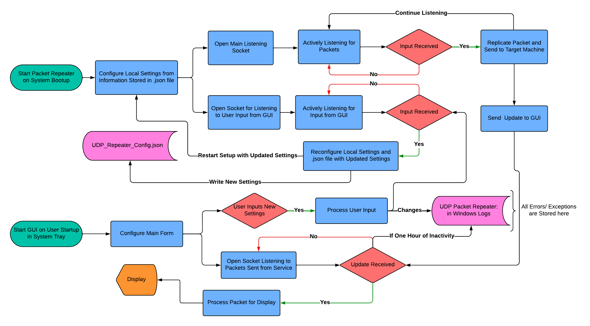
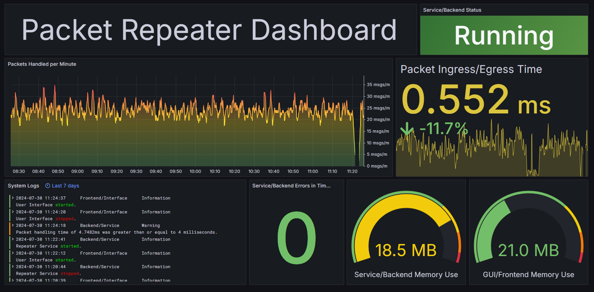

# Overview
This application was developed to solve a problem where multiple machines need to get the same UDP packets. It functions by listening for 
packets on a host machine using a raw socket to not disturb the packet's intended destination from receiving it. It then sends the payload of 
that packet out to a target endpoint using UDP Unicast, Multicast, or Broadcast. It was built as a Windows Service backend that interacts 
with a GUI frontend for user interaction and system monitoring. Included in this repo is the installer for the application. 

<p align="center">
  
  <em>System Task-Flow</em>
</p>


## Service/Backend
This Windows Service/Backend works by opening a raw socket with an endpoint that is specified by the user in the configuration JSON file under "Receive From". The 
socket used is raw so that it won't prevent the intended recipient of the packet from receiving it. Two things happen whenever a new packet is received: A copy of 
the packet's payload is sent out to the target "Send To" endpoint, and information about the packet is sent to the GUI/Frontend. At the same time, a task is listening 
continually for communication from the GUI/Frontend. This communication is made by sending packets over the loopback NIC. The Backend/Service receiving a packet 
from the Frontend/GUI means the user has input new configuration settings. The service then updates the configuration JSON file and restarts the thread that is listening 
for packets. The service is configured to begin running on system bootup under the "Local Machine" user account. This service reports its' memory used, total packets 
handled, and packet handling time to a user configured Prometheus endpoint. The service side has local logs in the Windows Event Log under the name:  
"UDP Packet Repeater" and the source: "UDP_Repeater_Backend". Logs are also sent to a user configured Loki endpoint with the source: "Backend/Service".

## GUI/Frontend
The GUI/Frontend is a Windows Forms application that displays statistical data about the service running, aggregates and displays the system's logs, and provides 
a way for the user to update the system's settings. The main form of the frontend is the form that displays statistical data, and holds the buttons that navigate 
to the other children forms of the GUI. Among those children are forms for settings reconfiguration and system log display. The GUI runs as a startup 
application when the user logs in. It is intended to run in the background and, as such, only runs out of the system tray. This GUI reports its' memory used to a 
user configured Prometheus endpoint. The GUI has local logs in the Windows Event Log under: "UDP Packet Repeater" and source: "UDP_Repeater_Frontend". Logs are 
also sent to a user-configured Loki endpoint with the source: "Frontend/GUI".

## Installer
The installer for this application is a 2 part Wix-toolset bootstrapper. It first installs .NET Framework 4.7.2 and then runs the main installer for the actual UDP 
Repeater Service. This installer downloads all the needed files for operation, registers the Service/Backend with the Windows Service Controller, and sets up 
the GUI to run on startup. Running [Packet_Repeater_Installer.exe](Packet_Repeater_Installer.exe) will do everything needed to get this system up and running. 
The source code for the installers ([Bundle.wxs](Packet_Repeater_Installer/Bundle.wxs) and [Product.wxs](UDP_Packet_Repeater_Installer/Product.wxs))
have paths to files that are relative to my development machine, so they will need to be updated with your correct local paths, or figure out how to use project 
the references to do it so that it will always work. I made it work with the service's project but didn't want to figure it out for the GUI so I just didn't.

## Monitoring
This system implements a Prometheus/Loki/Grafana monitoring stack for simple and powerful observability. System endpoints for Prometheus metrics and 
Loki logging are user-configurable through the GUI. This data is visualized using a Grafana dashboard. Dashboard setup information is included in this repo
in [Dashboard_Config.json](Monitoring/Dashboard_Config.json). 

To run the Prometheus server locally, use [prometheus.yml](Monitoring/prometheus.yml) as the configuration file with the following command and parameters:
```shell
PS C:\Users> .\prometheus.exe --enable-feature=otlp-write-receiver
```

To run the Loki server locally, use [loki-local-config.yaml](Monitoring/loki-local-config.yaml) as the configuration file with the following command:
```shell
PS C:\Users> .\loki-windows-amd64.exe --config.file=loki-local-config.yaml
```

<p align="center">
  
  <em> Running Grafana Dashboard </em>
</p>
