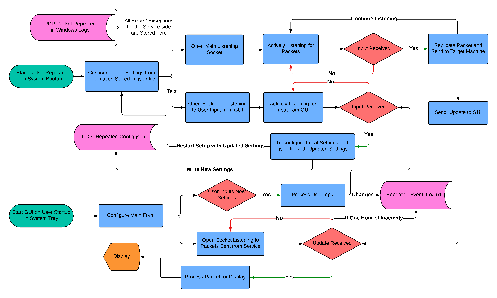
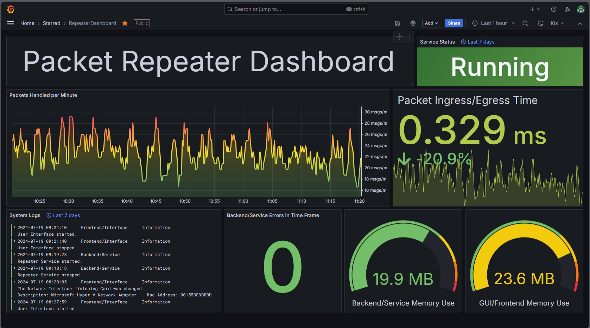

## Overview

This application was developed to solve a problem where multiple machines need to get the same UDP packets. It functions by listening for 
packets on a host machine, and then sending the payload of that packet out to a taget machine(s) using UDP Unicast, Multicast, or Broadcast. 
It was built as a Windows Service backend that interacts with a GUI frontend for user interaction and system monitoring. Included in this 
repo is the installer for the application. 

  

## Backend
This Windows Service/Backend works by starting a listening connection on a port that is specified by the configuration JSON file. Two things happen whenever
a new packet is received: A copy of the packet is sent out to the target "Send To" machine, and information about the packet is sent to the frontend. At the
same time, a task is listening continually for communication from the frond end, which means the user has input new configuration settings. The service then 
updates the configuration JSON file and restarts the thread that is listening for packets. The service is configured to begin running on system bootup.

## Frontend
The GUI/Frontend is a Windows Forms application that displays statistical data about the system running, collects and shows the system's logs, and provides 
a way for the user to update the system's settings. The main form of the frontend is the form that displays statistical data. From there, 
the user can open forms for settings reconfiguration or to see the system's logs. The GUI runs as a startup application when the user logs in. 
It is intended to run in the background and can only be found in the system tray.

## Installer
The installer for this application is a 3 part wix toolset bootstrapper. It first installs .NET Framework 4.7.2, then installs NpCap for use with the SharpPcap
library that is used by the Service, and then finally runs the main installer for the Packet Repeater Service. This installer downloads all the needed files for 
operation, registers the service side, and sets up the GUI to run on startup. Running the Packet_Repeater_Installer.exe file will do everything needed to get this 
system up and running. 

## Monitoring
This system implements a Prometheus/Loki/Grafana monitoring stack for simple and powerful observability. System endpoints for Prometheus metrics and 
Loki logging are user configurable through the GUI. This data is visualized using a grafana dashboard. Dashboard setup information is incluced in this repo
in the Dashboard_Config.json file. Below is a screenshot of the dashboard when running alongside this system. 

  

